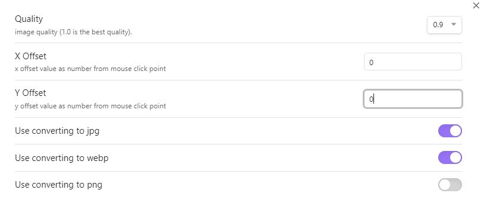
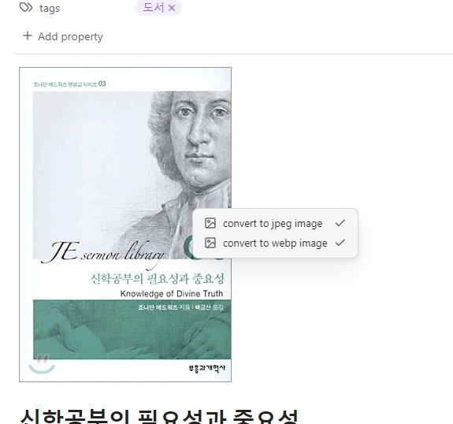

# Obsidian Image Helper Plugin

This plugin shows the following context menus:

- convert to jpeg image
- convert to webp image
- convert to png image

when you right click on the image in reading view of [Obsidian](https://obsidian.md/).

## Screenshots

## Installation
You can install this plugin in the Community Plugins tab of the [Obsidian](https://obsidian.md/).
Just search for "Image Helper" or goto this plugin page : [Link](https://obsidian.md/plugins?id=image-helper)

## Credits
This plugin uses some functions from the other plugin:

- https://github.com/musug/obsidian-paste-png-to-jpeg
- https://github.com/NomarCub/obsidian-copy-url-in-preview

If you like this plugin you can by me a coffe on Ko-fi here : 

